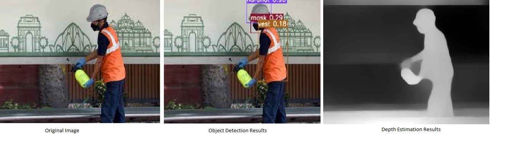

# <div align="center">YOLO-MiDaS for Autonomous Navigation</div>

This repository combines YOLOv3 for object detection and MiDaS for monocular depth estimation into a single model using a ResNeXt101 backbone. The idea is to use shared feature extractor for efficient real-time performance for autonomous navigation applications.

> The code in this repository is mostly adapted from [CaptainEven/YOLOV4_MCMOT](https://github.com/CaptainEven/YOLOV4_MCMOT) and old version of [ultralytics/yolov3](https://github.com/ultralytics/yolov3). MiDas model implementation code is from the original implementation [isl-org/midas](https://github.com/isl-org/MiDaS)

## <div align="center">Documentation</div>

>A `main.py` is not included in the repo as the same can be achived through `src/detect.py`.

### Install

Clone repo and install [requirements.txt](https://github.com/hattiq/yolo-midas/blob/master/requirements.txt) in a [**Python==3.6.0**](https://www.python.org/) environment.

```bash
git clone https://github.com/hattiq/yolo-midas  # clone
cd yolo-midas
pip install -r requirements.txt  # install
```

or use conda environment.

```bash
conda create -n yolo-midas python==3.6
conda activate yolo-midas
pip install -r requirements.txt
```

### Inference with detect.py

> Weights are not provided for the model, needs training first.

`src/detect.py` runs inference on images in the directory. Some sample images are provided at `data/sample`.

```bash
python src/detect.py --source data/sample --conf-thres 0.1 --output output --weights weights/best.pt
```

Outputs will be saved in `output` directory.

Sample output:




### Training

The model is trained on Construction Safety Gear Data which can be found here [Construction Safety Dataset](https://github.com/sarvan0506/EVA5-Vision-Squad/tree/Saravana/14_Construction_Safety_Dataset). If training need to done on custom datasets refer the data preparation steps mentioned in the page.

Place the data inside `data/customdata/custom.data` folder.
Please refer the config file `cfg/mde.cfg` to change the network configuration, freeze different branches. The model is an extension of YOLOv3 and MiDaS networks. Most of the configurations can be understood if familiar with yolo.

```bash
python src/train.py --data data/customdata/custom.data --batch 8 --cache --cfg cfg/mde.conf --epochs 50 --img-size 512
```

More details on training in [docs](docs/training.md).

---
### <div align="center">Further Details</div>

1. [Model Architecture](docs/model.md)
2. [Training Strategy](docs/training.md)
2. [Code](docs/code.md)

---
### <div align="center">Issues</div>
Some of the issues faced while working on the code:
1. Model Weights are not provided.
2. Dataset provided has some missing images. and does not work directly after downloading it.
3. A lot of code duplication, as the code is copied from other repos. Removed some of the unused code. But
As GPU access was not available, Could not reporduce the results.
4. SSIM code is not provided.
5. Jupyter notebooks code is broken and are not showing any analysis or visualizations of model and data. So deleted those.


---
### <div align="center">Improvements and Suggestions</div>
- **Backbone**: Experiment with more advanced backbones such as Vision Transformer or ConvNeXt for better feature extraction.
Other lightweight backbones like MobileNetV3 or EfficientNet can be explored for applications where efficiency and speed are critical.

- **Multi-Task Learning**: There is alot of literature available on multi-task learning that can be explored and experimented with for this problem. Primarily los

- **Data Augmentation**: This repository does not use as much augmentations, or may be the author experimented with but didn't work. 
Augmentations such as MixUp, Mosaic, horizontal flips, Brightness, contrast changes, and blurring can be helpful. Augmentation pipelines like Albumentations can be useful for more diverse augmentations.


- **Training**: LR Schedulers, optimizers and different configurations of loss functions can be experimented with.
Learning Rate Scheduling:


- **Deployment Improvements**: Model can be quantized and can be exported to ONNX for cross-platform compatibility or TensorRT.
Real-Time Performance:

- **Others**: Tools like MLFlow, ClearML can be integrated for reproducible trainings along with better visualizations and metrics.

---

### Refs
-  https://sarvan0506.medium.com/yolo-v3-and-midas-from-a-single-resnext101-backbone-8ba42948bf65
