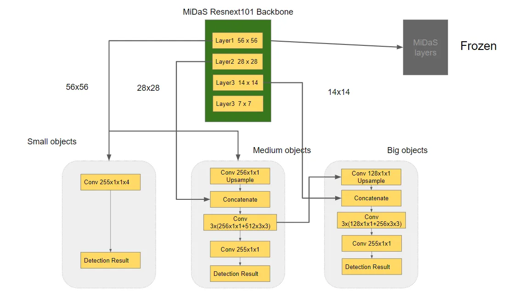
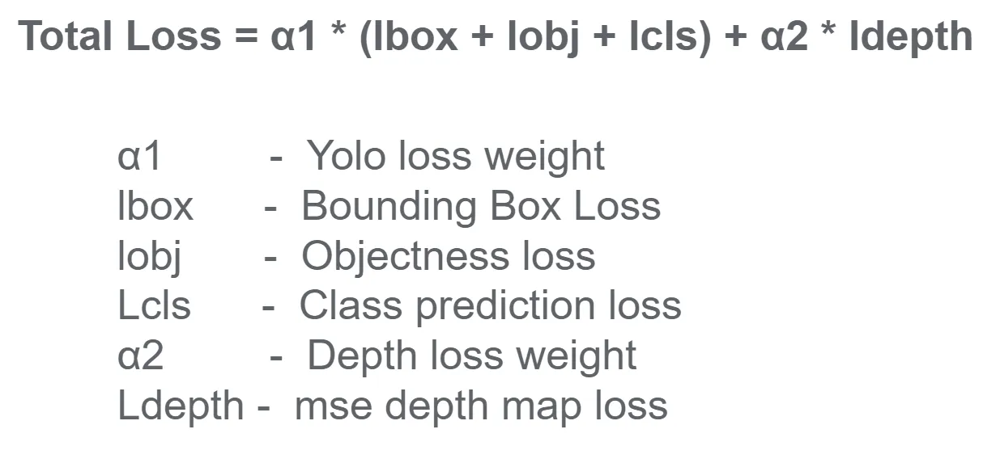

# **Training Strategy for YOLO-MiDaS**

The **training strategy** is described in the article ["YOLO-v3 and MiDaS from a Single ResNeXt101 Backbone"](https://medium.com/analytics-vidhya/yolo-v3-and-midas-from-a-single-resnext101-backbone-8ba42948bf65). 

>Although the code to automate the process is not provided but can be manually achived through changing config file.

---

## **Training Dataset**
The model was trained on the **Construction Safety Gear Dataset**, which includes:
- Images of workers wearing safety equipment (helmets, vests, boots, etc.).
- Ground truth **bounding boxes** and **class labels** for object detection.
- **Depth maps** as ground truth for depth estimation.

### **Custom Dataset Preparation**
To train the model on your custom dataset:
1. Include **images**, **bounding boxes**, and **class labels** for YOLOv3.
2. Provide **depth maps** for MiDaS (e.g., generated using LiDAR or stereo cameras).
3. Update the dataset configuration file (`data/customdata/*.data`) to point to the dataset paths.

---

## **4. Loss Function**

Author states that they experimented with SSIM (Structural Similarity Index) and simple MSE (calculated pixelwise) and prefered MSE based on results.

A **combined loss function** is used to optimize the two tasks:

---

## **5. Training Strategy**
The training process involves the following steps:

### **Pretraining**
- Uses the **ResNeXt101_32x8d_wsl backbone**, pre-trained on Instagram images (weakly supervised learning), as the shared feature extractor.

### **Training**
1. Freeze the MiDas branch and train only for the YOLO branch, save weights.
2. Introduce loss function for MiDaS network and define the total loss.
3. Load the model with all pre-trained weights and train all layers with a very less learning rate.

Author claims that after 50 epochs they achieved impressive results.
